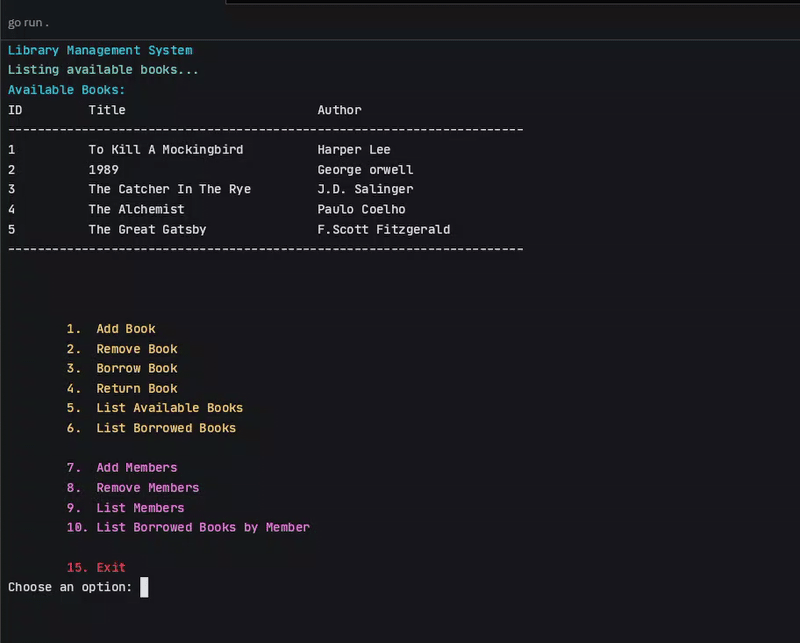

# Library Management System - Getting Started

## Overview



The Library Management System is a console-based application written in Go that helps manage books, members, and borrowing records in a library. This guide will help you get set up and running with the system.

## Prerequisites

- Go 1.24 or higher installed on your machine
- Basic knowledge of terminal/command line operations

## Installation

1. Clone the repository to your local machine:
   ```bash
   git clone https://github.com/a2sv-remote-g5c-NatnaelTaddese/go-backend-path.git
   cd 01-introduction/task-03/library-management-system
   ```

2. Build the application:
   ```bash
   go build -o library-app
   ```

3. Run the application:
   ```bash
   ./library-app
   ```

## Features

The Library Management System offers the following features:

### Book Management
- Add new books to the library
- Remove books from the collection
- Track book status (available or borrowed)
- List all available books

### Member Management
- Register new library members
- Remove members from the system
- List all registered members

### Borrowing System
- Allow members to borrow books
- Process book returns
- List books borrowed by specific members
- Generate reports of all borrowed books

## Using the Application

When you run the application, you'll be presented with a menu-driven interface:

```
Welcome to the Library Management System!

1.  Add Book
2.  Remove Book
3.  Borrow Book
4.  Return Book
5.  List Available Books
6.  List Borrowed Books

7.  Add Members
8.  Remove Members
9.  List Members
10. List Borrowed Books by Member

15. Exit

Choose an option:
```

## Example Workflow

1. Add some members to the system (option 7)
2. Add some books to the library (option 1)
3. Borrow books (option 3)
4. List borrowed books (option 6)
5. Return books (option 4)

## Error Handling

The system provides clear error messages for common scenarios:
- When trying to add a duplicate book or member
- When attempting operations on non-existent books or members
- When invalid input is provided

## Development and Extension

The system follows a clean architecture pattern, making it easy to extend:

- `models/` - Contains the data structures
- `services/` - Implements the business logic
- `controllers/` - Handles user interaction
- `utils/` - Provides helper functions

To add new features, consider creating additional methods in the appropriate components.

## Documentation

For more detailed information about the system architecture, API reference, and implementation details, please refer to our [comprehensive documentation](./docs/documentation.md).

The documentation includes:
- Complete API reference
- In-depth explanation of the architecture
- Error handling strategies
- Code examples for extending the system

## Troubleshooting

- Color codes may not display correctly in all terminal environments
- For more complex issues, consult the [documentation](./docs/documentation.md) or open an issue on GitHub
